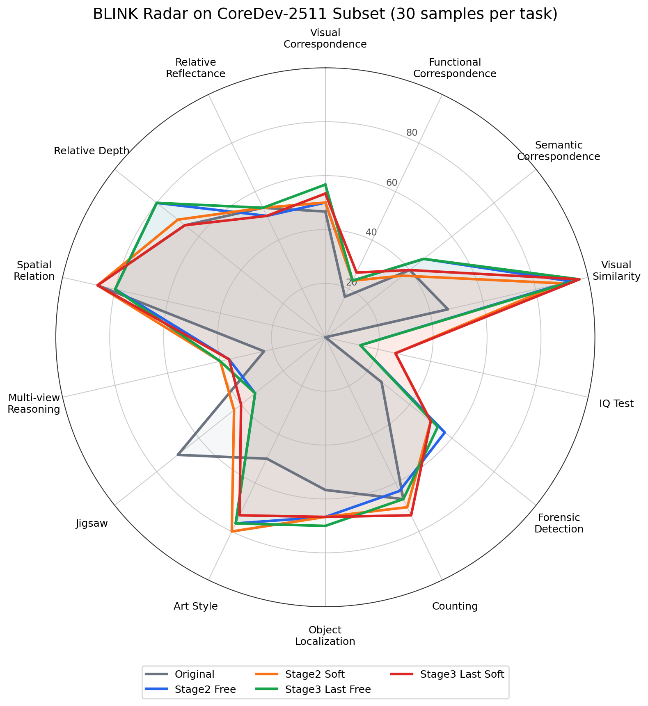

# CoreDev-2511 Evaluation Results

Date: 2026-07-02

Scope: complete `core_balanced_dev_2511_seed20260625` / CoreDev-2511 manifest, 2,511 samples.

Methods shown:

- `Original`: Qwen3 original baseline with max answer tokens 512.
- `Stage2 Free`: Stage2 checkpoint, `tgvf_free`.
- `Stage2 Soft`: Stage2 checkpoint, `tgvf_softforce`.
- `Stage3 Last Free`: Stage3 last checkpoint, step200, `tgvf_free`.
- `Stage3 Last Soft`: Stage3 last checkpoint, step200, `tgvf_softforce`.

All TGVF rows use the clean native backend, FlashAttention-2, DeepStack
`no_block`, post-D `kv_cache`, scoring backend `auto`, max image resolution
512, and unified `max_tokens=512`. Deltas are percentage points versus
`Original`.

## Overall Summary

| Method | Overall | Delta vs Original | Macro Avg | Macro Delta | Trigger | Parse | Append |
|---|---:|---:|---:|---:|---:|---:|---:|
| Original | 30.86% | +0.00 | 36.14% | +0.00 | - | 94.15% | - |
| Stage2 Free | 35.53% | +4.68 | 39.67% | +3.53 | 31.22% | 99.56% | 100.00% |
| Stage2 Soft | 35.98% | +5.12 | 39.90% | +3.77 | 45.24% | 99.64% | 100.00% |
| Stage3 Last Free | 36.40% | +5.54 | 40.57% | +4.44 | 30.78% | 99.60% | 100.00% |
| Stage3 Last Soft | 36.06% | +5.20 | 40.26% | +4.12 | 45.92% | 99.52% | 100.00% |

Best overall and macro result in this table is `Stage3 Last Free`: 36.40%
overall and 40.57% macro average.

## Per-Benchmark Results

| Benchmark | Original Acc | Stage2 Free Acc | Stage2 Free Delta | Stage2 Free Trigger | Stage2 Soft Acc | Stage2 Soft Delta | Stage2 Soft Trigger | Stage3 Last Free Acc | Stage3 Last Free Delta | Stage3 Last Free Trigger | Stage3 Last Soft Acc | Stage3 Last Soft Delta | Stage3 Last Soft Trigger |
|---|---:|---:|---:|---:|---:|---:|---:|---:|---:|---:|---:|---:|---:|
| VStar | 53.93% | 49.21% | -4.71 | 17.28% | 49.21% | -4.71 | 63.35% | 49.74% | -4.19 | 15.71% | 50.79% | -3.14 | 62.30% |
| HR | 52.00% | 54.00% | +2.00 | 38.00% | 51.50% | -0.50 | 73.00% | 54.50% | +2.50 | 37.50% | 54.00% | +2.00 | 75.00% |
| BLINK | 46.43% | 55.00% | +8.57 | 8.81% | 56.19% | +9.76 | 25.71% | 56.43% | +10.00 | 8.33% | 56.19% | +9.76 | 27.14% |
| OCRBench-v2 | 20.46% | 23.88% | +3.42 | 23.83% | 24.41% | +3.94 | 43.67% | 24.15% | +3.69 | 23.83% | 24.23% | +3.76 | 42.33% |
| MMMU-Pro | 34.33% | 34.67% | +0.33 | 31.67% | 33.00% | -1.33 | 34.33% | 35.67% | +1.33 | 31.00% | 34.00% | -0.33 | 34.33% |
| MathVista | 41.00% | 46.33% | +5.33 | 21.00% | 50.00% | +9.00 | 28.67% | 48.33% | +7.33 | 19.33% | 48.00% | +7.00 | 30.67% |
| MathVerse | 4.80% | 14.60% | +9.80 | 67.40% | 15.00% | +10.20 | 62.00% | 15.20% | +10.40 | 67.80% | 14.60% | +9.80 | 64.20% |

## BLINK Radar

This radar chart uses the CoreDev-2511 BLINK subset only: 420 samples, 14
subtasks, 30 samples per subtask. It should not be read as the official BLINK
validation-set score over 1,901 samples.

## BLINK Subtask Values

| Subtask | n | Original | Stage2 Free | Stage2 Soft | Stage3 Last Free | Stage3 Last Soft |
|---|---:|---:|---:|---:|---:|---:|
| Visual Correspondence | 30 | 46.67% | 50.00% | 50.00% | 56.67% | 53.33% |
| Functional Correspondence | 30 | 16.67% | 23.33% | 23.33% | 23.33% | 26.67% |
| Semantic Correspondence | 30 | 40.00% | 46.67% | 36.67% | 46.67% | 40.00% |
| Visual Similarity | 30 | 46.67% | 93.33% | 90.00% | 96.67% | 96.67% |
| IQ Test | 30 | 0.00% | 13.33% | 26.67% | 13.33% | 26.67% |
| Forensic Detection | 30 | 26.67% | 56.67% | 50.00% | 53.33% | 50.00% |
| Counting | 30 | 66.67% | 63.33% | 70.00% | 66.67% | 73.33% |
| Object Localization | 30 | 56.67% | 66.67% | 66.67% | 70.00% | 66.67% |
| Art Style | 30 | 50.00% | 76.67% | 80.00% | 76.67% | 73.33% |
| Jigsaw | 30 | 70.00% | 33.33% | 43.33% | 33.33% | 40.00% |
| Multi-view Reasoning | 30 | 23.33% | 36.67% | 40.00% | 40.00% | 36.67% |
| Spatial Relation | 30 | 86.67% | 80.00% | 86.67% | 80.00% | 86.67% |
| Relative Depth | 30 | 66.67% | 80.00% | 70.00% | 80.00% | 66.67% |
| Relative Reflectance | 30 | 53.33% | 50.00% | 53.33% | 53.33% | 50.00% |

## Result Paths

| Method | Summary |
|---|---|
| Original | `outputs/clean_benchmarks/qwen3_original_coredev2511_4shard_maxans512_20260628_0216_rescored_bboxfix_20260628_035759/merged/summary.json` |
| Stage2 Free | `outputs/clean_benchmarks/qwen3_stage2_norm01_coredev2511_dynamic_maxtok512_flash2_multigridfix_gpu0_7_20260701_235228/tgvf_free/summary.json` |
| Stage2 Soft | `outputs/clean_benchmarks/qwen3_stage2_norm01_coredev2511_dynamic_maxtok512_flash2_multigridfix_gpu0_7_20260702_011343/tgvf_softforce/summary.json` |
| Stage3 Last Free | `outputs/clean_benchmarks/qwen3_stage3_step200_coredev2511_dynamic_maxtok512_flash2_gpu0_7_20260702_023637/tgvf_free/summary.json` |
| Stage3 Last Soft | `outputs/clean_benchmarks/qwen3_stage3_step200_coredev2511_dynamic_maxtok512_flash2_gpu0_7_20260702_023637/tgvf_softforce/summary.json` |

