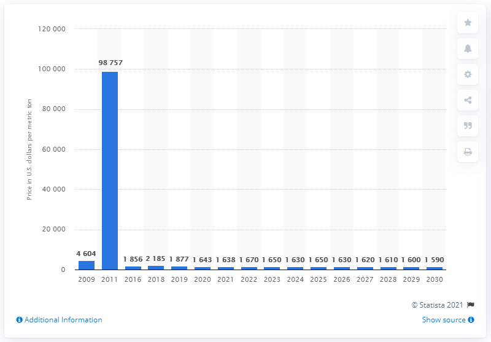
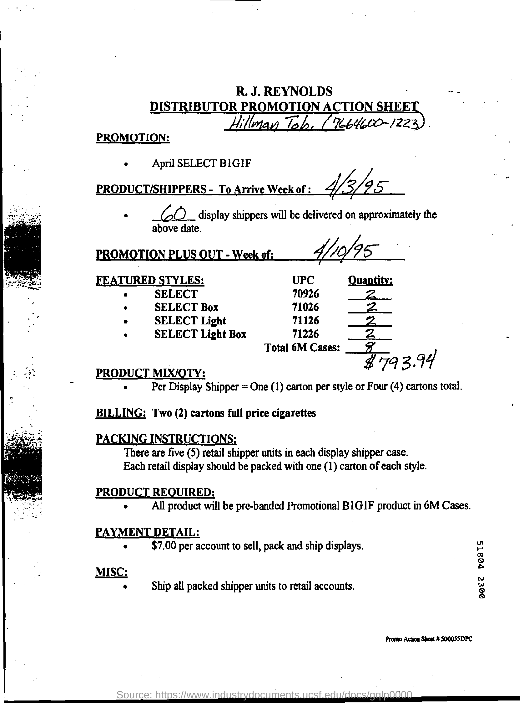

# TGVF 50K Data Examples

This note shows representative examples from the current Stage2 open-answer
50K training split in a compact presentation format.

Source split:

```text
data/tgvf_teacher/generated/runs/tgvf_v4_teacher_50k_clean_imend_open_answer/splits/tgvf_v4_teacher_stage2_protocol_c.train.jsonl
```

Split identity:

```text
rows: 46883
single_focus: 39312
multi_focus: 343
direct_answer: 7228
```

The format below is a readable presentation of the current Protocol-C
tool-observation trajectory. The real runtime inserts learned visual
embeddings for `D`; `[D_VISUAL_TOKENS]` is not text.

Display format:

```text
Input: Image & Question

VLM Output:
<|think|>
Reasoning ...
I need refocus ...
<|/think|>
<|foveate|> Target <|/foveate|>

Tool:
<|vision start|> D <|vision end|>

VLM Output:
<|think|>
Evidence and reasoning ...
<|/think|>
Answer
```

## Single-Focus Examples

### Single 1: Bird Beak Color

Source: `visual_genome`  
Image id: `visual_genome:2363183`


```text
Input:
Image + Question:
What color is the bird's beak?

VLM Output:
<|think|>
The bird is clear in the scene, but the beak is a small detail. A closer look
at the head and beak area would make the color more reliable.
I need refocus on the bird's head and beak.
<|/think|>
<|foveate|> close-up of the bird's head, beak surface, and surrounding face feathers <|/foveate|>

Tool:
<|vision start|> [D_VISUAL_TOKENS] <|vision end|>

VLM Output:
<|think|>
The focused view shows a warm orange beak rather than red, black, or yellow.
<|/think|>
orange
```

### Single 2: Remote Control Color

Source: `textocr`  
Image id: `textocr:849b83e927a81ef6`


```text
Input:
Image + Question:
What color is the main body of the remote control?

VLM Output:
<|think|>
The remote is easy to spot in the scene, but a closer look at its casing helps
confirm the dominant surface color rather than the darker buttons.
I need refocus on the remote casing surface.
<|/think|>
<|foveate|> broad front casing surface of the remote around the buttons and lower edge <|/foveate|>

Tool:
<|vision start|> [D_VISUAL_TOKENS] <|vision end|>

VLM Output:
<|think|>
The focused view shows the body itself is metallic silver, distinct from the
darker button areas.
<|/think|>
silver
```

### Single 3: Document Manager Name

Source: `docvqa`  
Image id: `docvqa:ktdw0079_1`


```text
Input:
Image + Question:
Who is listed as the manager in the organizational chart?

VLM Output:
<|think|>
The manager should appear in a prominent box near the top of the chart, so I
should inspect the upper central title box closely.
I need refocus on the top center manager box.
<|/think|>
<|foveate|> upper central boxed name and italic job title beneath it <|/foveate|>

Tool:
<|vision start|> [D_VISUAL_TOKENS] <|vision end|>

VLM Output:
<|think|>
The focused box explicitly labels Dr. D. J. Doolittle as the manager.
<|/think|>
Dr. D. J. Doolittle
```

## Multi-Focus Examples

### Multi 1: Closest Chart Value

Source: `chartqa`  
Image id: `chartqa:train_004281`


```text
Input:
Image + Question:
Which category is closest in value to 100 trillion Iranian rial?

VLM Output:
<|think|>
To find the category closest to 100, I first need the bars near that level
rather than the much larger ones.
I need refocus on the bars around the 100 mark.
<|/think|>
<|foveate|> the mid-to-lower bars around the 100 mark with their category labels and value labels <|/foveate|>

Tool:
<|vision start|> [D_VISUAL_TOKENS_STEP_1] <|vision end|>

VLM Output:
<|think|>
Now I know the closest candidates are 93.47 and 49.58, and 93.47 is only 6.53
away from 100. I should confirm the category attached to 93.47.
I need refocus on the 93.47 bar and its label.
<|/think|>
<|foveate|> the bar labeled 93.47 together with the category name directly below it <|/foveate|>

Tool:
<|vision start|> [D_VISUAL_TOKENS_STEP_2] <|vision end|>

VLM Output:
<|think|>
Since 93.47 is closest to 100 and that bar is Capital investment, that is the
correct choice.
<|/think|>
Capital investment
```

### Multi 2: Bar Difference

Source: `chartqa`  
Image id: `chartqa:train_022524`



```text
Input:
Image + Question:
How much larger is the 2011 value than the 2009 value?

VLM Output:
<|think|>
To compute the difference, I need the exact labels for the two bars involved
rather than estimating from height alone.
I need refocus on the 2011 bar label first.
<|/think|>
<|foveate|> the very tall 2011 bar with the numeric label printed above its top <|/foveate|>

Tool:
<|vision start|> [D_VISUAL_TOKENS_STEP_1] <|vision end|>

VLM Output:
<|think|>
I now have the 2011 value. I still need the exact 2009 label to subtract
correctly.
I need refocus on the 2009 bar label.
<|/think|>
<|foveate|> the short 2009 bar at the far left with its numeric label above the bar <|/foveate|>

Tool:
<|vision start|> [D_VISUAL_TOKENS_STEP_2] <|vision end|>

VLM Output:
<|think|>
Using the focused values, 98 757 minus 4 604 equals 94 153.
<|/think|>
94 153
```

### Multi 3: Document Table Total

Source: `docvqa`  
Image id: `docvqa:gqlp0000_6`



```text
Input:
Image + Question:
What is the total quantity across all four featured styles?

VLM Output:
<|think|>
The total must be computed from the four handwritten quantities in the FEATURED
STYLES table, so I should first read those entries and then verify the total
line.
I need refocus on the four featured style quantity entries.
<|/think|>
<|foveate|> all four FEATURED STYLES rows with the handwritten Quantity entries <|/foveate|>

Tool:
<|vision start|> [D_VISUAL_TOKENS_STEP_1] <|vision end|>

VLM Output:
<|think|>
Those four entries sum to 8. I can confirm this against the total line shown
just below the table.
I need refocus on the total line below the quantity column.
<|/think|>
<|foveate|> Total 6M Cases line directly below the quantity column in the same table <|/foveate|>

Tool:
<|vision start|> [D_VISUAL_TOKENS_STEP_2] <|vision end|>

VLM Output:
<|think|>
The computed sum is 8, and the total line below the table also shows 8, so the
total quantity is confirmed.
<|/think|>
8
```

